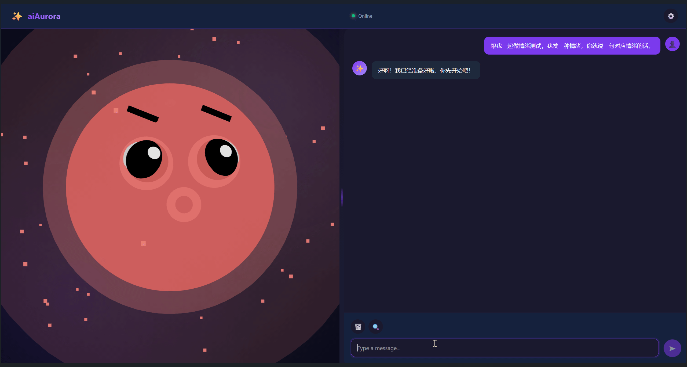
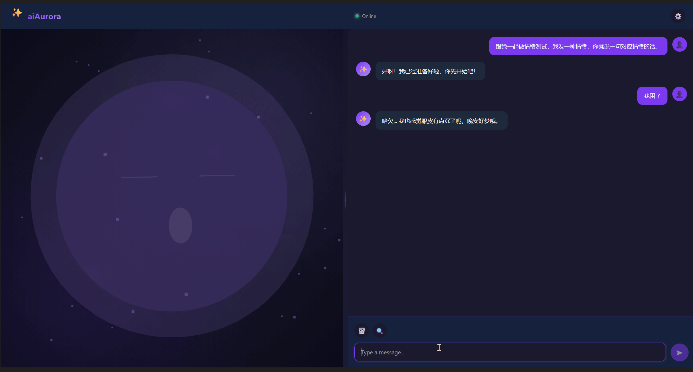

# aiAurora ✨

*最后更新: 2026-06-05*

[English](#english) | [中文](#中文)

---

## 中文

### 项目简介

**aiAurora** 是一款具有情感表达能力的AI虚拟伴侣应用。它采用现代Web技术构建，通过3D虚拟形象与用户进行自然交互，能够感知对话内容并展现出丰富的情绪反应。

### 核心特性

#### 🤖 智能对话

- 支持 OpenAI 兼容 API（OpenAI、Anthropic、Azure OpenAI、DeepSeek 等）
- 支持本地部署的 Ollama 大语言模型
- 流式响应，带来自然的对话体验
- Markdown 渲染支持（代码块、列表等）

#### 🎭 21种情感系统 (PAD模型)

- **基础情绪**（12种）：开心、兴奋、喜爱、悲伤、担忧、愤怒、惊讶、恐惧、厌恶、平静、思考、困倦
- **人格情绪**（9种）：困惑、窘迫、无奈、吃醋、怅然若失、害羞、调皮、自豪、感激
- 每种情绪都有独特的视觉表现（眼睛、嘴巴、眉毛、腮红颜色）和动态效果
- 情绪检测链：JSON解析 → LLM二次分析 → 关键词回退

#### 🎤 ASR 语音识别

- **语音输入**：点击话筒 🎤 按钮激活，长按 "Hold to speak" 录制麦克风
- **本地 ASR 推理**：基于 FunASR (SenseVoice + Qwen3-0.6B) 模型，16kHz PCM 实时解码
- **交互方式**：按下录音 → 松开自动发送 → ASR 转文字 → 送入聊天窗口 → LLM 回复
- **可配置**：Settings 中可设置 ASR Server URL 和 API Key，默认 `http://localhost:8001`

#### 🔊 TTS 语音合成

- **语音输出**：点击喇叭 🔊 按钮激活，LLM 回复自动朗读
- **本地 TTS 推理**：基于 Qwen3-TTS-12Hz-1.7B 模型，支持 21 种情绪语调
- **情绪语音**：TTS 语气与 Avatar 表情完全一致（开心、悲伤、温柔、调皮等）
- **流式播放**：逐句生成、逐句播放，减少等待延迟
- **可配置**：Settings 中可设置 TTS Server URL、API Key、发言人、语言，默认 `http://localhost:8002`

> 语音服务需要在本地分别启动 ASR 和 TTS 推理服务，见下方"语音服务"章节。

#### 🔍 联网搜索

- 支持多种搜索提供商：博查AI、SerpAPI、Wikipedia、DuckDuckGo
- 博查AI推荐国内使用，免费额度可用
- 开启后在对话中点击搜索图标即可使用实时搜索结果

#### 👤 多重人格

- **治愈系**：温柔体贴，暖心陪伴
- **元气系**：活力四射，热情洋溢
- **傲娇系**：外表冷淡，内心柔软
- **毒舌**：犀利幽默，毒舌但善良
- **沉稳**：理性冷静，逻辑清晰
- **戏精**：戏剧张力，夸张有趣
- **默认**：温暖友好的AI伴侣

#### ⚙️ 可定制化

- API 端点和模型配置
- 语音开关和音量调节
- 回复语言设置（中/英/日/韩/法/德/西/葡/俄/阿等）
- 可调节大小的分屏布局

### 技术架构

```
┌─────────────────────────────────────────────────────────────┐
│                      Presentation Layer                       │
│  React 18 + TypeScript 5 + CSS Variables                   │
│  ├── App.tsx (布局、错误边界、可调节分屏)                      │
│  ├── AvatarCanvas.tsx (Three.js 3D 形象)                    │
│  ├── Chat.tsx (聊天界面、语音、搜索、Markdown)                 │
│  └── Settings.tsx (设置面板)                                 │
├─────────────────────────────────────────────────────────────┤
│                      State Management                         │
│  Zustand 4 (chatStore.ts)                                   │
│  ├── 消息、情绪、设置、人格                                   │
│  └── LocalStorage + Electron Store 持久化                    │
├─────────────────────────────────────────────────────────────┤
│                      LLM 集成                                 │
│  utils/llm.ts + utils/streamParser.ts                       │
│  ├── OpenAI API (SSE 流式)                                  │
│  ├── Ollama API (NDJSON 流式)                               │
│  └── 情绪检测 (JSON + LLM + 关键词)                          │
├─────────────────────────────────────────────────────────────┤
│                      联网搜索                                 │
│  utils/webSearch.ts                                         │
│  ├── 博查AI (POST，国内推荐)                                 │
│  ├── SerpAPI、Bing、Wikipedia、DuckDuckGo                   │
│  └── 搜索结果注入 LLM 系统提示                               │
├─────────────────────────────────────────────────────────────┤
│                      3D 渲染                                  │
│  Three.js 0.158 + @react-three/fiber + @react-three/drei   │
│  ├── 球体几何体 (发光球体 + 内外发光)                          │
│  ├── 眼睛组件 (21种独特配置)                                 │
│  ├── 嘴巴组件 (19种独特形状)                                 │
│  ├── 眉毛组件 (旋转 + 不对称)                                │
│  ├── 腮红组件 (颜色 + 透明度 + 脉动)                           │
│  └── 粒子系统 (60-100个四色星空粒子)                            │
├─────────────────────────────────────────────────────────────┤
│                      语音推理服务                              │
│  models_infer/                                              │
│  ├── funasr_server.py (ASR, 端口 8001)                      │
│  └── qwen3_tts_server.py (TTS, 端口 8002)                   │
├─────────────────────────────────────────────────────────────┤
│                      桌面端 (可选)                            │
│  Electron 41 + electron-builder                             │
│  ├── main.ts (窗口、IPC、全局快捷键)                         │
│  └── preload.ts (上下文桥接)                                 │
└─────────────────────────────────────────────────────────────┘
```

### 技术栈

| 类别       | 技术                                                      |
| ---------- | -------------------------------------------------------- |
| 构建工具    | Vite 5                                                   |
| 前端框架   | React 18, TypeScript 5                                   |
| 3D渲染     | Three.js 0.158, @react-three/fiber, @react-three/drei (星空粒子系统) |
| 状态管理   | Zustand 4                                                |
| Markdown   | react-markdown 9.x                                       |
| 大语言模型 | OpenAI 兼容 API, Ollama                                  |
| 联网搜索   | 博查AI, SerpAPI, Wikipedia, DuckDuckGo                   |
| 语音 ASR   | FunASR-Nano-2512 (SenseVoice + Qwen3-0.6B)              |
| 语音 TTS   | Qwen3-TTS-12Hz-1.7B-CustomVoice                         |
| 测试       | Vitest 4.x, Playwright 1.60, Testing Library             |
| 桌面端     | Electron 41 (可选)                                       |

### 快速开始

#### 前置要求

- Node.js 18+
- npm 或 yarn

#### 安装

```bash
git clone https://github.com/nors1993/Emoji_aiAurora.git
cd Emoji_aiAurora
npm install
```

#### 开发模式

```bash
# 启动 Web 开发服务器 (http://localhost:5173)
npm run dev

# 或启动 Electron 桌面版
npm run electron:dev
```

#### 生产构建

```bash
# Web 构建
npm run build
# 输出目录: dist/

# Electron 桌面应用构建
npm run electron:build
# 输出目录: release/
```

#### 测试

```bash
# 单元测试
npx vitest run

# E2E 测试
npx playwright test

# 覆盖率
npx vitest run --coverage
```

### 配置说明

首次使用需要配置 LLM API：

1. 点击右上角 ⚙️ 按钮打开设置
2. 选择 API 提供商（OpenAI 兼容 / Ollama 本地）
3. 输入 API URL、API Key、模型名称
4. 选择人格类型
5. 可选：开启语音和联网搜索
6. 保存设置即可开始对话

### 语音服务

ASR 和 TTS 需要独立启动 Python 推理服务：

```bash
# 终端 1: ASR (端口 8001)
cd Emoji_aiAurora
.venv/bin/python models_infer/funasr_server.py

# 终端 2: TTS (端口 8002)
.venv/bin/python models_infer/qwen3_tts_server.py
```

在 Settings → Voice Service Settings 中配置：

| 设置项 | 默认值 |
|--------|--------|
| ASR Server URL | `http://localhost:8001` |
| ASR API Key | `sk-funasr-demo` |
| TTS Server URL | `http://localhost:8002` |
| TTS API Key | `sk-qwen3tts-demo` |
| TTS Speaker | `Vivian` |
| TTS Language | `Chinese` |

然后在 Settings → Voice Settings 中开启 **Enable Text-to-Speech**，回到聊天界面即可看到 🎤（话筒）和 🔊（喇叭）按钮：

- 点击 🎤 激活语音输入 → 长按 "Hold to speak" 录音 → 松开自动 ASR 转文字发送
- 点击 🔊 激活语音输出 → LLM 回复自动 TTS 朗读（语气与 Avatar 表情一致）

### 联网搜索配置 (博查AI - 推荐)

1. 访问 https://open.bochaai.com/ 注册账号
2. 创建 API Key
3. 在设置中开启"联网搜索"
4. 输入博查AI API Key
5. 对话时点击搜索图标启用搜索

### 🧪 测试

项目包含完整的测试体系：

```bash
# 运行所有单元测试
npx vitest run

# 监听模式 (开发)
npx vitest

# 生成覆盖率报告
npx vitest run --coverage

# 运行 E2E 测试 (Playwright)
npx playwright test

# E2E 交互式调试
npx playwright test --ui

# 运行性能基准测试
bash scripts/run-benchmark.sh
```

测试覆盖：
- **单元测试** (Vitest): `llm.ts`、`streamParser.ts`、语音模块
- **E2E 测试** (Playwright): Chromium 浏览器端到端流程
- **集成测试**: 组件交互、API 集成
- **性能基准**: 情绪检测、LLM 响应、语音性能

### 支持的语言

中文 (zh-CN)、英语 (en-US)、日语 (ja-JP)、韩语 (ko-KR)、法语 (fr-FR)、德语 (de-DE)、西班牙语 (es-ES)、葡萄牙语 (pt-BR)、俄语 (ru-RU)、阿拉伯语 (ar-SA)

### 项目结构

```
src/
├── main.tsx                    # 应用入口
├── App.tsx                    # 根组件 (布局、分屏)
├── App.css                    # 布局样式
├── index.css                  # 全局 CSS 变量、主题
├── components/
│   ├── Avatar/
│   │   ├── AvatarCanvas.tsx   # 3D 形象渲染 (21种情绪)
│   │   └── Avatar.css
│   ├── Chat/
│   │   ├── Chat.tsx          # 聊天界面
│   │   └── Chat.css
│   └── Settings/
│       ├── Settings.tsx      # 设置面板
│       └── Settings.css
├── stores/
│   └── chatStore.ts          # Zustand 状态管理
├── types/
│   └── index.ts               # 类型定义 + 情绪库数据
└── utils/
    ├── llm.ts                 # LLM API 调用
    ├── streamParser.ts        # SSE 流解析
    └── webSearch.ts           # 联网搜索

models_infer/                  # 语音推理服务
├── funasr_server.py           # ASR (FunASR-Nano, 端口 8001)
└── qwen3_tts_server.py        # TTS (Qwen3-TTS-1.7B, 端口 8002)

tests/                         # 测试套件
├── unit/                      # 单元测试 (Vitest)
│   ├── llm.test.ts
│   ├── streamParser.test.ts
│   └── voice.test.ts
├── e2e/                       # E2E 测试 (Playwright)
│   └── benchmark-e2e.spec.ts
├── integration/               # 集成测试
└── performance/               # 性能测试

benchmark/                     # 性能基准
├── emotion-benchmark.json
├── llm-benchmark.json
├── voice-benchmark.json
├── benchmark.md
└── ...

electron/
├── main.ts                    # Electron 主进程
└── preload.ts                 # 上下文桥接
```
### Demo




### Changelog

#### 2026-06-05 — Testing Infrastructure, Benchmarks & Avatar Polish

| Category | Changes | File |
|------|---------|------|
| 🟢 Testing | Added Vitest 4.x unit test framework with jsdom environment | `vitest.config.ts`, `tests/setup.ts` |
| 🟢 Testing | Unit tests for `llm.ts`, `streamParser.ts`, voice services | `tests/unit/` |
| 🟢 Testing | Playwright 1.60 E2E tests (chromium, parallel mode) | `playwright.config.ts`, `tests/e2e/` |
| 🟢 Testing | Integration and performance test suites | `tests/integration/`, `tests/performance/` |
| 🟡 Benchmark | Comprehensive benchmark suite (emotion, LLM, voice, perf) | `benchmark/` |
| 🟡 Benchmark | Performance benchmark scripts with threshold validation | `scripts/` |
| 🟠 Particle | 4-color star particle system (primary/secondary/accent/glow) | `src/components/Avatar/AvatarCanvas.tsx` |
| 🟠 Particle | Increased to 60-100 particles (based on emotion intensity) | `src/components/Avatar/AvatarCanvas.tsx` |
| 🟠 Particle | Added `key={emotion}` to ensure correct re-render on emotion change | `src/components/Avatar/AvatarCanvas.tsx` |
| 🟢 Eyebrow | Base position increased 0.32→0.35 to prevent occlusion by eyes | `src/components/Avatar/AvatarCanvas.tsx` |
| 🟢 Eyebrow | Dynamic compensation `(1 - eyeScaleY) * 0.5` for auto-adjust when eyes shrink | `src/components/Avatar/AvatarCanvas.tsx` |
| 🟢 Eyebrow | Adjusted vertical offset for all emotions to ensure eyebrows are always visible | `src/components/Avatar/AvatarCanvas.tsx` |

#### 2026-05-21 — Security Hardening & Error Handling

| 类别 | 修改内容 | 文件 |
|------|---------|------|
| 🔴 安全 | 删除 LLM 请求中的 API Key 日志泄露 | `src/utils/llm.ts` |
| 🔴 安全 | 删除 WebSearch 中的 API Key 长度日志 | `src/utils/webSearch.ts` |
| 🔴 安全 | Electron IPC 添加设置 key 白名单校验 | `electron/main.ts` |
| 🟠 错误处理 | 修复 15 处空 catch 块 — 补充日志与错误传播 | 涉及 8 个文件 |
| 🟡 弃用API | `.substr(2,9)` → `.substring(2,11)` | `src/stores/chatStore.ts` |
| 🟡 超时 | `getOllamaModels` 添加 5s 超时控制 | `src/utils/llm.ts` |

### License

MIT

---

## English

### Overview

**aiAurora** is an AI-powered virtual companion with emotional expressions. Built with modern web technologies, it features a 3D avatar that interacts with users through natural conversation, perceiving dialogue content and responding with rich emotional reactions.

### Key Features

#### 🤖 Intelligent Conversation

- Supports OpenAI-compatible APIs (OpenAI, Anthropic, Azure OpenAI, DeepSeek, etc.)
- Supports locally deployed Ollama large language models
- Streaming responses for natural dialogue experience
- Markdown rendering (code blocks, lists, etc.)

#### 🎭 21-Emotion System (PAD Model)

- **Base Emotions** (12): Happy, Excited, Love, Sad, Concerned, Angry, Surprised, Fearful, Disgusted, Neutral, Thinking, Sleepy
- **Personality Emotions** (9): Confused, Embarrassed, Helpless, Jealous, Longing, Shy, Playful, Proud, Grateful
- Each emotion has unique visual expressions (eyes, mouth, eyebrows, cheek color) and dynamic effects
- Emotion detection chain: JSON parsing → LLM analysis → Keyword fallback

#### 🎤 ASR (Speech-to-Text)

- **Voice input**: Click the 🎤 microphone button to activate, long-press "Hold to speak" to record
- **Local ASR inference**: Powered by FunASR (SenseVoice + Qwen3-0.6B), 16kHz PCM real-time decoding
- **Flow**: Press to record → Release to send → ASR transcription → Text in chat → LLM replies
- **Configurable**: ASR Server URL and API Key in Settings (default `http://localhost:8001`)

#### 🔊 TTS (Text-to-Speech)

- **Voice output**: Click the 🔊 speaker button to activate, LLM responses auto-spoken
- **Local TTS inference**: Powered by Qwen3-TTS-12Hz-1.7B, supports 21 emotional tones
- **Emotional speech**: TTS tone matches the Avatar's expression (happy, sad, gentle, playful, etc.)
- **Streaming playback**: Sentence-by-sentence generation and playback
- **Configurable**: TTS Server URL, API Key, speaker, language in Settings (default `http://localhost:8002`)

#### 🔍 Web Search

- Supports multiple providers: Bocha AI, SerpAPI, Wikipedia, DuckDuckGo
- Bocha AI recommended for China mainland (free tier available)
- Click search icon in chat to enable real-time search results

#### 🧪 Testing

The project includes a comprehensive testing suite:

```bash
# Run all unit tests
npx vitest run

# Watch mode (development)
npx vitest

# Generate coverage report
npx vitest run --coverage

# Run E2E tests (Playwright)
npx playwright test

# Interactive E2E debugging
npx playwright test --ui

# Run performance benchmarks
bash scripts/run-benchmark.sh
```

Coverage:
- **Unit Tests** (Vitest): `llm.ts`, `streamParser.ts`, voice modules
- **E2E Tests** (Playwright): Chromium browser end-to-end flows
- **Integration Tests**: Component interactions, API integration
- **Performance Benchmarks**: Emotion detection, LLM response, voice performance

#### 👤 Multiple Personalities

- **Default**: Warm and friendly AI companion
- **Healing**: Gentle, warm, patient
- **Energetic**: Vibrant, enthusiastic
- **Tsundere**: Cold on the outside, soft on the inside
- **Witty**: Sharp humor with kindness
- **Calm**: Rational, logical, measured
- **Dramatic**: Theatrical, epic, exaggerated

#### ⚙️ Customizable

- API endpoint and model configuration
- Voice toggle and volume control
- Response language settings (zh-CN, en-US, ja-JP, ko-KR, fr-FR, de-DE, es-ES, pt-BR, ru-RU, ar-SA)
- Resizable split panel layout

### Tech Stack

| Category         | Technology                                              |
| ---------------- | ------------------------------------------------------- |
| Build            | Vite 5                                                 |
| Frontend         | React 18, TypeScript 5                                 |
| 3D Rendering     | Three.js 0.158, @react-three/fiber, @react-three/drei (Star particle system) |
| State Management | Zustand 4                                              |
| Markdown         | react-markdown 9.x                                     |
| LLM              | OpenAI Compatible API, Ollama                          |
| Web Search       | Bocha AI, SerpAPI, Wikipedia, DuckDuckGo               |
| Voice            | Web Speech API (Recognition + Synthesis)               |
| Testing          | Vitest 4.x, Playwright 1.60, Testing Library            |
| Desktop          | Electron 41 (Optional)                                 |

### Quick Start

```bash
# Install
git clone https://github.com/nors1993/Emoji_aiAurora.git
cd Emoji_aiAurora
npm install

# Development (Web)
npm run dev

# Development (Electron)
npm run electron:dev

# Build (Web)
npm run build

# Build (Electron)
npm run electron:build
```

### Testing

```bash
# Unit tests
npx vitest run

# E2E tests
npx playwright test

# Coverage
npx vitest run --coverage
```

### Configuration

1. Click the ⚙️ icon to open Settings
2. Select API Provider (OpenAI Compatible / Ollama)
3. Enter API URL, API Key, and model name
4. Choose personality type
5. Optional: Enable voice and web search
6. Save and start chatting

### Web Search Setup (Bocha AI - Recommended)

1. Visit https://open.bochaai.com/ to register
2. Create an API Key
3. Enable "Web Search" in Settings
4. Enter your Bocha AI API Key
5. Click the search icon in chat to enable search

### Demo


### License

MIT
